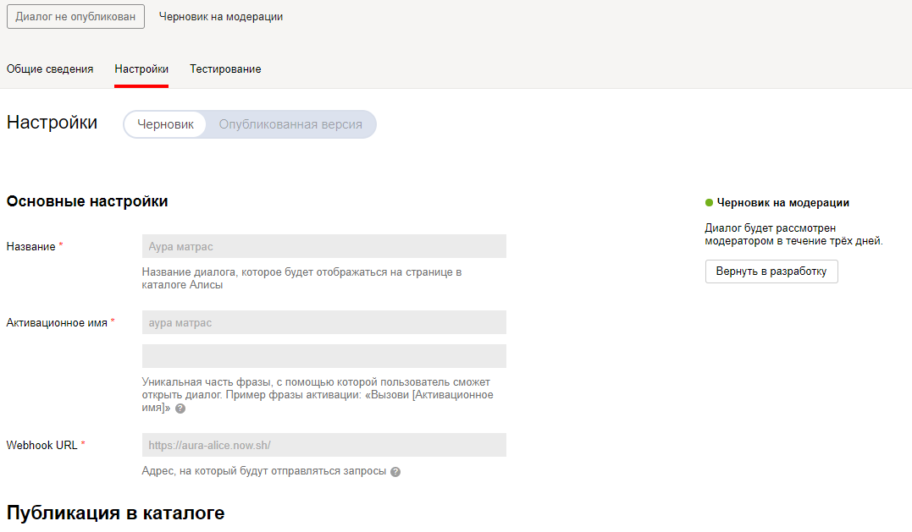

Бот для диалогов Алисы Яндекса

# Установка

Установить now.sh (https://zeit.co/)

Перейти в папку "aura-alice"

Отредактировать файл now.json указать настройки:
```
TO_MAIL - адрес менеджера куда будут отправляться чаты с клиентами
SMTP_SERVER, SMTP_LOGIN, SMTP_PASSWORD - настройки почтового ящика с которого будут отправляться письма
(проверено, что письма c smtp.yandex.ru - не принимаются, а с smtp.gmail.com - принимаются)
FROM_EMAIL - адрес отправителя, обычно совпадает с SMTP_LOGIN
```

Выполнить команды:
```
now --public
now alias aura-alice
```

Последняя команда назначит URL текущего приложения в https://aura-alice.now.sh

## Настройка диалогов

Это нужно сделать один раз.

Зайти в диалоги: https://beta.dialogs.yandex.ru/developer/skills/

Указать URL адрес в параметре "WebHook URL"

Настроить остальные параметры



# Доп информация

https://tech.yandex.ru/dialogs/alice/

https://tech.yandex.ru/dialogs/alice/doc/about-docpage/